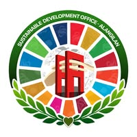

<p align="center">
  
</p>

<h1 align="center">Sustainable Development Office — BSU Alangilan</h1>
<p align="center"><b>Empowering sustainable campus initiatives and tracking UN Sustainable Development Goals (SDGs).</b></p>
<p align="center">
  A premium, interactive web application showcasing Batangas State University Alangilan's commitment to "Future Ready, Sustainability Steady" campus actions.
</p>

<p align="center">
  <a href="#-features">Features</a> •
  <a href="#%EF%B8%8F-tech-stack">Tech Stack</a> •
  <a href="#-getting-started">Getting Started</a> •
  <a href="#%EF%B8%8F-project-architecture">Architecture</a>
</p>

---

## ✨ Features

### 🌟 Split-Grid Hero Collage (Concept 1)
- Left-aligned, high-impact headline, responsive descriptions, and a pulsing branding chip (`People • Planet • Purpose`).
- Right-aligned animated collage of sustainability images featuring card rotation tilts, border outlines, and lifting shadows on hover.

### 📊 Interactive 17 SDGs Dashboard
- Showcases the official high-resolution icon sets for all 17 United Nations Sustainable Development Goals.
- Dynamic hover overlays styled after the UN Portal, rendering descriptions, goals, metrics, and links in vertical rectangle aspect grids (`aspect-[3/4]`) to prevent cutoff.

### 🔄 Infinite Marquee Initiatives Track
- Smooth, infinite auto-scrolling marquee presenting campus green programs (*SolarCanopy*, *BioLoop Compost*, *SustainaShare Hub*).
- Built-in scrollspy interrupt handling with precise float accumulators, bypassing asynchronous rounding limits to avoid browser subpixel sticking lockups.

### 📱 Responsive Mobile Layout & Bottom Navbar
- Responsive header rendering for large screens.
- Modern, app-like fixed bottom navigation bar (`md:hidden`) with custom responsive SVG icons and scrollspy checks mapping directly to viewport locations.

### 📩 Unified Contact & Footer Section
- Blends the Contact split-grid layout (Office location details, operating hours, and impact metrics) and the compact Footer bar (utility navigation, logo branding, and social handles) into a single unified workspace to avoid text and spacing redundancy.
- Embeds the custom collaboration forms directly to remove modal popups.

### 🛡️ Smart Form Filters & Validations
- **Strict Keyboard Sanitizer**: Automatically filters out numbers and special symbols on type, permitting only alphabetical letters, spaces, periods, and hyphens. Caps key spams at max `3` repeating matching letters.
- **Physical Bounds**: Strict length constraints (`maxLength` limits of 50 chars for name, 80 for email, 100 for organization, 500 for messages).
- **Keyboard Submission**: Intercepts `Enter` presses to submit forms instantly while preserving normal line breaks on `Shift + Enter` in textareas.

---

## 🛠️ Tech Stack

- **Core**: React 18, Vite
- **Routing**: React Router DOM (Single Page Application architecture)
- **Styling**: Tailwind CSS v4 (configured with custom eco-branding greens), Google Fonts (**Outfit** Integration)
- **Quality Assurance**: ESLint, Prettier

---

## 🚀 Getting Started

### 📋 Prerequisites
Make sure you have [Node.js](https://nodejs.org/) installed (v18+ recommended).

### 🔧 Setup & Installation

1. **Clone the repository**:
   ```bash
   git clone https://github.com/dnlaldrn/sdo-website.git
   cd sdo-website
   ```

2. **Install all dependencies**:
   ```bash
   npm install
   ```

3. **Run the local development server**:
   ```bash
   npm run dev
   ```
   Open your browser and navigate to `http://localhost:5173` (or the terminal-supplied URL).

4. **Verify lint rules and formatting**:
   ```bash
   npm run lint
   ```

5. **Build the production bundle**:
   ```bash
   npm run build
   ```

---

## 🗂️ Project Architecture

```txt
sdo-website/
├── public/                 # Static public assets (Favicon, UN SDG badges)
│   ├── sdg/                # Official 1-17 SDG icons
│   └── logo.jpg            # SDO Alangilan brand logo
├── src/
│   ├── assets/             # Bundled local image assets
│   ├── components/         # Reusable UI component blocks
│   │   ├── ContactForm/    # Validation form card & keyboard interceptors
│   │   ├── Footer/         # Unified bottom portal & split details cards
│   │   └── Navbar/         # sticky header navigation & mobile bottom bar
│   ├── layout/             # Route layout elements
│   ├── pages/              # Single-page layout sections
│   │   ├── About.jsx       # About / Vision-Mission
│   │   ├── Home.jsx        # Redesigned split hero landing
│   │   ├── Initiatives.jsx # Auto-scroll initiatives track
│   │   └── SDG.jsx         # 17 SDG grid cards
│   ├── App.jsx             # SPA React Router configuration
│   ├── App.css             # Base style sheet, Outfit font, custom Tailwind @theme
│   └── main.jsx            # Application mount point
├── utils/                  # Refactored static structural data feeds
│   ├── footerLinks.js
│   ├── initiativesData.js
│   ├── navItems.js
│   └── sdgData.js
├── README.md               # Repository documentation
└── package.json            # Scripts & project dependencies
```
